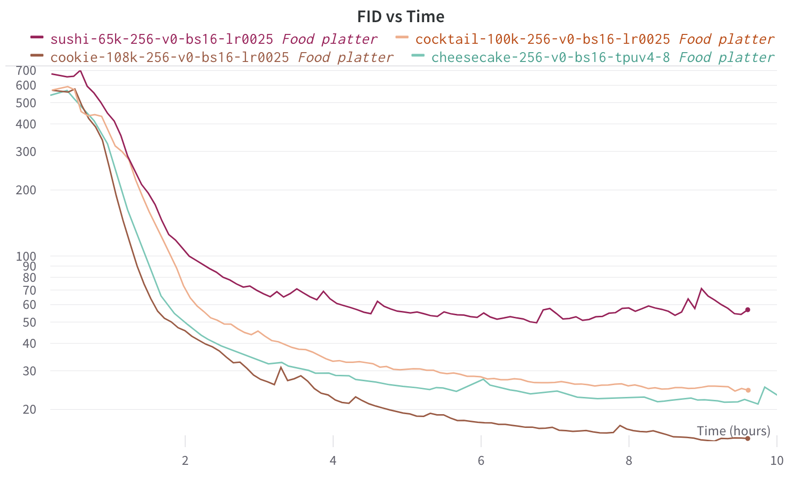

## This Food Does Not Exist 🍪🍰🍣🍹

`cookie-256.pkl`

`cheesecake-256.pkl`

`cocktail-256.pkl`

`sushi-256.pkl`

Cherry-picked results, check out the Colab notebook to generate your own: 

Or train your own model: [https://github.com/nyx-ai/stylegan2-flax-tpu](https://github.com/nyx-ai/stylegan2-flax-tpu)

## Why not diffusion models? 🤔

Diffusion models are all the rage these days: [DALL·E 2](https://openai.com/dall-e-2/), [Craiyon](https://www.craiyon.com/) (formerly DALL·E mini), [ruDALL-E](https://rudalle.ru/en/)... Why not go in this direction?

### Realism vs control

StyleGAN models shine in terms of photorealism, as can be some by some of our food results. For another example, the website [ThisPersonDoesNotExist.com](https://thispersondoesnotexist.com/) produces very believable face images. While GANs are still better at this, [diffusion models are catching up](https://arxiv.org/abs/2105.05233) and this may change soon.

Diffusion models offer better control and flexibility, thanks in large part to text guidance. This comes at the cost of larger models and slower generation times.

### Training resources

We were able to train the provided models in less than 10h each using a single TPU v4-8:

In comparison, Craiyon is being training on a v3-256 TPU pod which means 32x the resources (albeit using the previous TPU generation) and the training [has been going on for over a month](https://wandb.ai/dalle-mini/dalle-mini/reports/DALL-E-Mega-Training-Journal--VmlldzoxODMxMDI2)!

## Acknowledgements 🙏

* This work is based on Matthias Wright's [stylegan2](https://github.com/matthias-wright/flaxmodels/tree/main/training/stylegan2) implementation.
* The project received generous support from Google's TPU Research Cloud (TRC).
